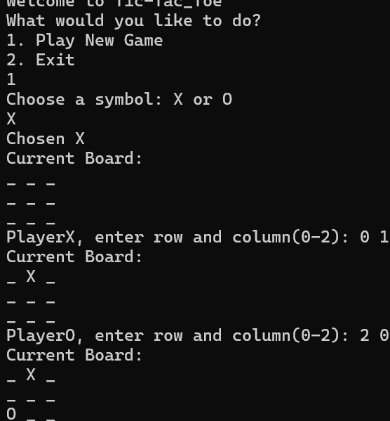

# Tic-Tac-Toe (C++)

## Project Overview
This project is a command-line Tic-Tac-Toe game developed in C++. It allows two players to play against each other in the terminal by taking turns placing X and O on a 3x3 board. The program updates the board after every move, checks for winners, and ends the game when a player wins or when the board is full.

This project demonstrates foundational programming concepts including loops, conditionals, arrays, functions, input validation, and game logic.

---

## Purpose / Problem Being Solved
The purpose of this project was to build an interactive terminal application while practicing core C++ programming skills.

The project solves the challenge of creating a fully functional two-player game that can:
- Accept and validate player input
- Keep track of the board state
- Detect winning combinations
- Identify draw conditions
- Alternate turns between players

It also helped strengthen problem-solving and logical thinking skills.

---

## Technologies Used
- C++
- Standard Library (`iostream`)
- Command Line / Terminal
- g++ Compiler

---

## Project Structure
```text
.
├── tic-tac-toe.cpp        # Main source code file
├── Sample.docx            # Sample output / example run
├── proj1_data.txt         # Output file of the results
└── README.md              # Project documentation
```

---

## Setup / Installation / Usage Instructions

### 1. Clone the Repository
```bash
git clone https://github.com/Sakar-Ojha/Tic-Tac-Toe.git
cd tic-tac-toe
```

### 2. Compile the Program
Use g++ or any C++ compiler:

```bash
g++ tic-tac-toe.cpp -o tic_tac_toe
```

### 3. Run the Program

#### Linux / macOS
```bash
./tic_tac_toe
```

#### Windows
```bash
tic_tac_toe.exe
```

---

## Key Features / Functionality
- Two-player gameplay (Player X vs Player O)
- Interactive turn-based system
- Input validation for invalid or occupied positions
- Automatic win detection:
  - Rows
  - Columns
  - Diagonals
- Draw detection when no spaces remain
- Board updates after every move
- Clear command-line interface

---

## Example Usage / Sample Output

```text
   |   |  
-----------
   |   |  
-----------
   |   |  

Player X turn:
Enter row and column: 1 1

 X |   |  
-----------
   |   |  
-----------
   |   |  

Player O turn:
Enter row and column: 2 2

 X |   |  
-----------
   | O |  
-----------
   |   |  
```

> A full example run is included in `Sample.docx`
> ## Screenshot



---

## My Role / Contribution
I independently designed and implemented this project as a C++ programming assignment.

My contributions included:
- Designing the board structure
- Writing the gameplay loop
- Handling user input
- Creating win/draw detection logic
- Displaying the board after each turn
- Testing and debugging the program

---

## Reflection / Challenges / Lessons Learned
One of the main challenges in this project was implementing reliable win detection for all possible row, column, and diagonal combinations.

Through this project, I learned:
- How to break a larger problem into smaller functions
- How to debug logical errors in game flow
- How arrays can represent game boards
- How to build interactive terminal programs in C++

This project strengthened my confidence in writing complete programs from start to finish.

---

## Future Improvements
Possible future enhancements include:
- Single-player mode vs BOT
- Replay option after each game
- Score tracking system
- Improved terminal graphics
- GUI version using a graphics library

---
```
